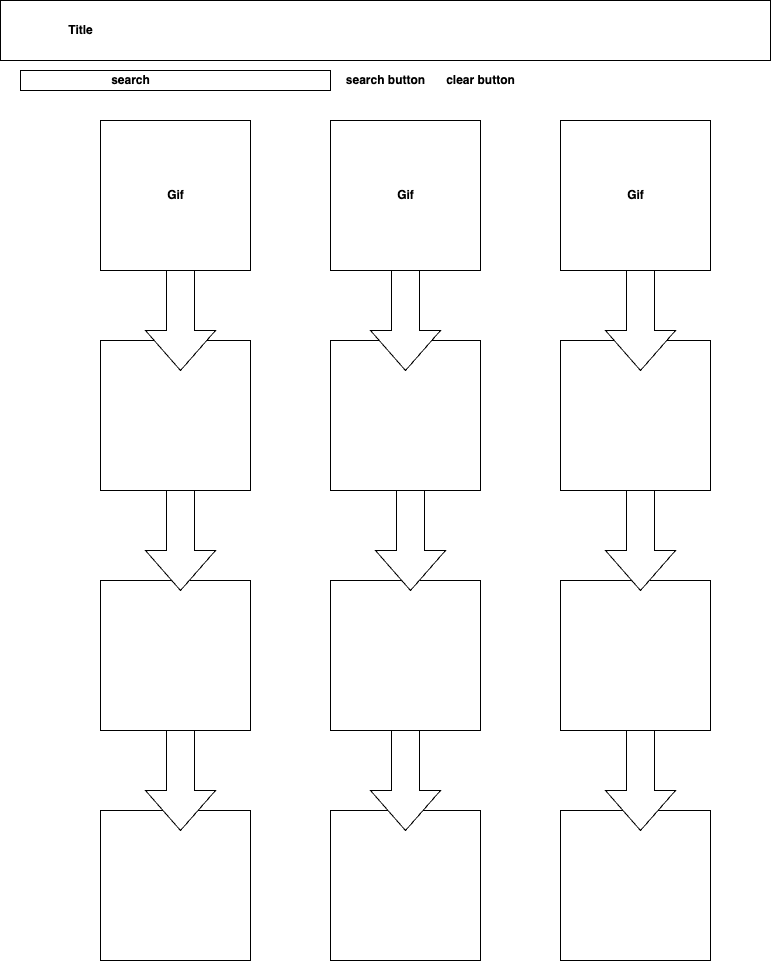

# Lydia Jarvis: Project-2
# Description:

This website is made for searching a keyword in the search bar and displaying results in a grid of results.

# Technologies used:
- HTML
- Javascript
- Asynchronous
- CSS
- API
- Google fonts
- Github

# User stories:
- As a user, I would like to search for gifs using a keyword in the search bar
- As a user, I would like to see a clean and easy to use home page
- As a user, I would like to be able to scroll through the gifs and see them organized in a grid

# Wireframe:

# Future Improvemnets:
- I would like to create a better style
- Make a more generic looking brand 
- Make the "return" button on the keyboard to search instead of having to manually push the search button